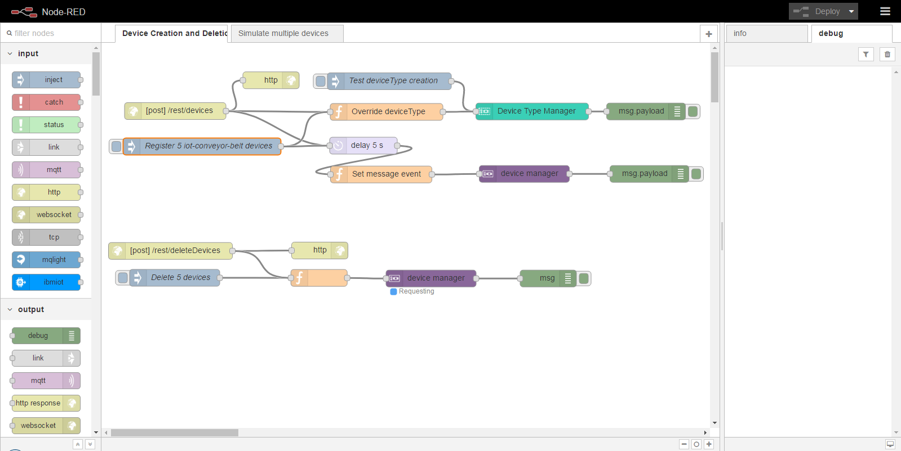
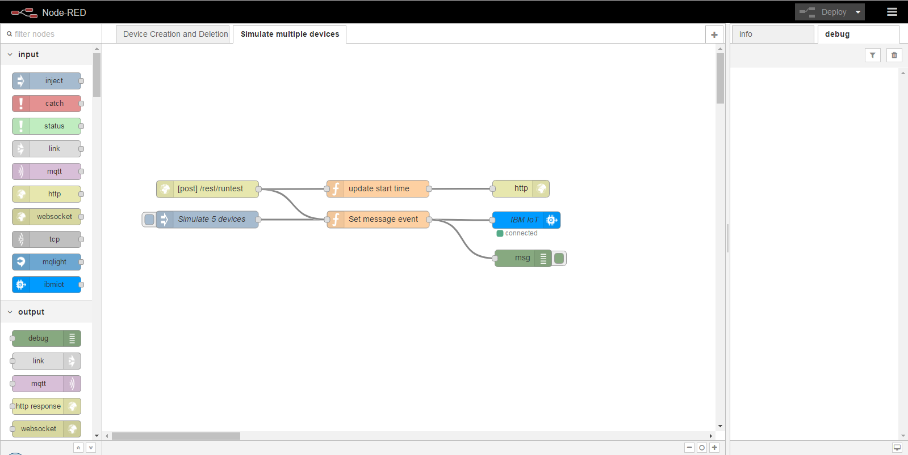

# Watson IoT Platform Getting Started Guides
This sample application is included as a component in a set of Getting Started guides that step through the basics of developing a ready-for-production, end-to-end IoT prototype system with Watson IoT Platform.

Developers who are new to working with Watson IoT Platform can use the step-by-step processes in the Getting Started guides to develop and deploy a solution that demonstrates one or more Watson IoT Platform features.

For more information about the getting started guides, see the [Watson IoT Platform documentation](https://console.bluemix.net/docs/services/IoT/getting_started/getting-started-iot-overview.html).

## Simulation of multiple devices

<!--
  
-->

## Objective
In this lesson, you would be able to simulate multiple conveyor belt devices using [Node-RED](https://nodered.org) available on the Bluemix. This flow itself could be deployed using single button deployment or manually. The application contains flows to   
1. Create multiple devices   
2. Delete the devices   
3. Simulate event publishing concurrently   

<figure><figurecaption>Device Creation and Deletion</figurecaption></figure>   

<figure><figurecaption>Device Event Simulation</figurecaption></figure>

## Deployment on Bluemix

### Pre-requisites

Bluemix account in US South / United Kingdom region with    
a. Bluemix Space created   
b. More than 512 MB RAM   
c. More than 1 GB disk quota  
d. More than 2 services available   

### Steps
_Note that Steps 6 is only needed in case previous lessons have not been carried out_  
1. Download and install the [Cloud-foundry CLI](https://github.com/cloudfoundry/cli).
2. Clone the app to your local environment from your terminal using the following command: <pre><code>git clone https://github.com/ibm-watson-iot/iot-guide-conveyor-multi-simulator.git </code></pre>   
3. cd into this newly created directory.
4. From the command line, set your API endpoint by running the cf api command.
Replace the API-ENDPOINT value with the API endpoint for your region.:
<pre><code>
$ cf api API-ENDPOINT
</code></pre>
<table>
<tr><th>Region</th><th>API Endpoint</th></tr>   
<tr><td>US South</td><td>https://api.ng.bluemix.net</td></tr>   
<tr><td>United Kingdom</td><td>https://api.eu-gb.bluemix.net</td></tr>  
<!-- Commented Germany for now   
<tr><td>Germany</td><td>https://api.eu-de.bluemix.net</td></tr>   
-->
</table>
<pre><code>
$ cf login
</code></pre>  

5. Create the Cloudant service in Bluemix  
<pre><code>$ cf create-service cloudantNoSQLDB Lite lesson4-simulate-cloudantNoSQLDB</code></pre>    

6. This step is only needed in case you don't want to use the previous IoT service. The below given command would create an IoT service with the name `lesson4-simulate-iotf-service`. In case you want to create the service with a different name, provide the other name in place of `lesson4-simulate-iotf-service` <pre><code>$ cf create-service iotf-service iotf-service-free lesson4-simulate-iotf-service </code></pre>   
7. Run the cf push command to push the application into Bluemix:
Give your application a unique name.  
<pre><code>$ cf push APPNAME</code></pre>  

You now have your own instance of the app running on the Bluemix.  

### Securing your Node-RED flow
Although this step is non mandatory, its a good practice to secure your flow.  
1. Secure your editor so that only authorised users can access it.  
2. To secure the flow go to the Bluemix dashboard and select the application which you just deployed.
3. Click on Runtime and select the Environment variables tab.  
4. Add the following user-defined environment variables in  
a. NODE_RED_USERNAME  
b. NODE_RED_PASSWORD  
and provide your values.
5. Save the flow  
Note that in case you secure your flow and plan to use ReST call to create / delete or simulate the multiple devices, you need to add the username and password in Basic Authentication.  

## Usage Instructions
You can directly click the inject node or make a ReST call.  
For any of the ReST calls, you can either use cURL or the ReST client add-on plugin available in Mozilla.  

### Device Creation
To register multiple devices, either
1. Click on the inject node (labelled as **"Register 5 iot-conveyor-belt devices"** in the Node-RED flow) or
2. Make an HTTP **POST** request to the URL https://URL.mybluemix.net/rest/devices with the following JSON payload <pre><code>{   
"numberDevices":5,   
"typeId":"iot-conveyor-belt",    
"authToken":"mypassword",    
"chunkSize":5,  
"deviceName":"belt"     
}</code></pre> keeping 'Content-Type' and 'Accept' as 'application/json'   

In the above payload, 'authToken', 'chunkSize' and 'typeId' are optional and if the 'chunkSize' is not provided, it defaults to 500.  
The 'chunksize' has to be less than and should be a factor of numberDevices (this restriction would be removed shortly). Similarly, if typeId is not provided, it defaults to "devices". All the devices are created with a name starting from the value given against deviceName (in this case, its 'belt') and appended with a number.   

### Device Deletion
To delete devices, either
1. Click on the inject node (labelled as **"Delete 5 devices"** in the Node-RED flow) or
2. Make an HTTP **POST** (not **DELETE**) request to https://URL.mybluemix.net/rest/deleteDevices and pass the following JSON message.     
<pre><code>{      
"numberDevices":5,   
"deviceType":"iot-conveyor-belt",
"deviceName": "belt"  
}</code></pre>

### Concurrent Event simulation
To simulate the flow, either  
1. Click on the inject node (labelled as **"Simulate 5 devices"** in the Node-RED flow) or
2. Make an HTTP **POST** request to https://URL.mybluemix.net/rest/runtest and pass the following JSON message   
<pre><code>{
"numberDevices":5,   
"numberEvents":10,   
"timeInterval":1000,
"deviceType":"iot-conveyor-belt",  
"deviceName":"belt"     
}</code></pre>

## Privacy notice

This web application includes code to track deployments to [IBM Bluemix](https://www.bluemix.net/) and other Cloud Foundry platforms. The following information is sent to a [Deployment Tracker](https://github.com/cloudant-labs/deployment-tracker) service on each deployment:

* Application Name (`application_name`)
* Space ID (`space_id`)
* Application Version (`application_version`)
* Application URIs (`application_uris)``

This data is collected from the `VCAP_APPLICATION` environment variable in IBM Bluemix and other Cloud Foundry platforms. This data is used by IBM to track metrics around deployments of sample applications to IBM Bluemix to measure the usefulness of our examples, so that we can continuously improve the content we offer to you. Only deployments of sample applications that include code to ping the Deployment Tracker service will be tracked.

### Disabling deployment tracking

Deployment tracking can be disabled by removing the require("cf-deployment-tracker-client").track(); line from  'bluemix-settings.js' file.

## Useful links
[Install Node.js]: https://nodejs.org/en/download/
[bluemix_dashboard_url]: https://console.ng.bluemix.net/dashboard/
[bluemix_signup_url]: https://console.ng.bluemix.net/registration/
[cloud_foundry_url]: https://github.com/cloudfoundry/cli

[IBM Bluemix](https://bluemix.net/)  
[IBM Bluemix Documentation](https://www.ng.bluemix.net/docs/)  
[IBM Bluemix Developers Community](http://developer.ibm.com/bluemix)  
[IBM Watson Internet of Things](http://www.ibm.com/internet-of-things/)  
[IBM Watson IoT Platform](http://www.ibm.com/internet-of-things/iot-solutions/watson-iot-platform/)   
[IBM Watson IoT Platform Developers Community](https://developer.ibm.com/iotplatform/)
