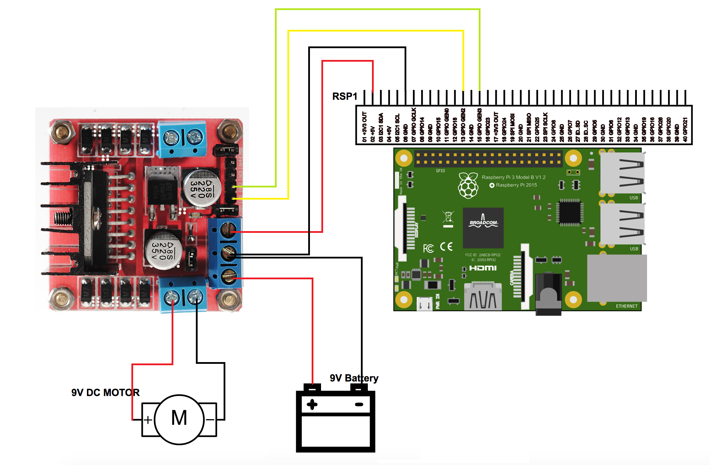

## Watson IoT Platform getting started guides
This sample application is included as a component in a set of Getting Started guides that step through the basics of developing a ready-for-production, end-to-end IoT prototype system with Watson IoT Platform.

Developers who are new to working with Watson IoT Platform can use the step-by-step processes in the Getting Started guides to develop and deploy a solution that demonstrates one or more Watson IoT Platform features.

For more information about the getting started guides, see the [Watson IoT Platform documentation](https://console.bluemix.net/docs/services/IoT/getting_started/getting-started-iot-overview.html).


## Connect a device to Watson IoT Platform

In this lesson, you will learn how to connect a Raspberry Pi device to the Watson IoT Platform. You will learn how to interface a motor with the Raspberry Pi and then connect the Raspberry Pi with Watson IoT Platform

### Requirements
#### Hardware

1. [Raspberry Pi(2/3)](https://www.raspberrypi.org/) with Raspbian OS v 4.4+
2. L298N Dual H Bridge Motor Driver Board
3. 9v DC motor
4. 9v Battery

#### Software
1. python 2.7.9 and above(pre-installed with Raspbian OS)
2. [Watson IoT Python library](https://github.com/ibm-watson-iot/iot-python)


### Step 1 : Hardware configuration

You will need all the hardware present in the requirements for this step

Below is the schematic diagram for the circuit.



Connections are
* Raspberry pi 's pin 2 to +5v of L298N board
* Raspberry pi 's pin 6 to GND of L298N board
* Raspberry pi 's pin 13 to IN1 of L298N board
* Raspberry pi 's pin 15 to IN2 of L298N board
* +9v of Battery to +12v of L298N board
* -9v of Battery to GND of L298N board
* Motor's +ve node to OUT1 of L298N board
* Motor's -ve node to OUT2 of L298N board

### Step 2 :  Getting the code from repository and configure

Open the terminal or ssh to your Raspberry pi.

(*Optional*) If you do not have `git` installed in your Raspberry Pi, you can install it with the following command

```bash
$ sudo apt-get install git
```

* Git Clone this repository in your Raspberry Pi

```bash
$ git clone https://github.com/ibm-watson-iot/iot-guide-conveyor-rasp-pi
$ cd iot-guide-conveyor-rasp-pi

```
* You may need to make shell script executable use this command `sudo chmod +x setup.sh`
* Run the setup.sh and fallow the instruction given in that

```bash

$ ./setup.sh

```

<!--
* Install the dependencies

```
$ pip install ibmiotf

```
* Update the  lesson1b/device.conf file with your device credentials

    e.g. `org = <your org>` to `org = xxxx`
```
[device]
org = <your org>
type =  <your device type>
id =  <your device id>  
auth-method = token
auth-token =  <your device token>
``` -->


### Step 3 : Run the program

```
python deviceClient.py -t 2

```
#### For help run

```
python deviceClient.py -h
```

Now this client program will start your motor connected and publish the device sensor data to the Watson IoT platform every second, it will stop after 2 minutes as per given parameter.

## Useful links
[Python]: https://www.python.org/
[Raspberry pi]: https://www.raspberrypi.org/


[IBM Bluemix](https://bluemix.net/)  
[IBM Bluemix Documentation](https://www.ng.bluemix.net/docs/)  
[IBM Bluemix Developers Community](http://developer.ibm.com/bluemix)  
[IBM Watson Internet of Things](http://www.ibm.com/internet-of-things/)  
[IBM Watson IoT Platform](http://www.ibm.com/internet-of-things/iot-solutions/watson-iot-platform/)   
[IBM Watson IoT Platform Developers Community](https://developer.ibm.com/iotplatform/)
